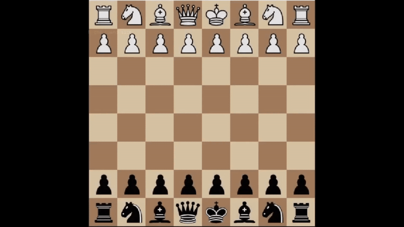

# Ozgur 2.0: A Network-Based Chess AI

## Gameplay Example

---

### Motivation
This project aims to exploit the NNUE architecture to create a personalized chess AI that mimics my chess playing behavior. Using Stockfish, I evaluated over of my 15,000 online chess games spanning the past seven years, from two of the most popular chess platforms, **Lichess** and **Chess.com**. Downloading and running Stockfish (https://stockfishchess.org/) to evaluate my own games and then using custom defined functions, I trained my own neural network that allows both Player vs. AI as well as AI vs AI. The ultimate goal is to develop a chess AI that makes not necessarily the absolute best moves, but the moves that I would have most likely made. 

### Brief NNUE Introduction
NNUE (Efficiently Updatable Neural Network) architectures are designed for lightweight and efficient evaluations of chess positions. Unlike traditional chess engines, which rely on handcrafted evaluation functions, NNUE use neural networks to evaluate positions more dynamically while utilizing existing chess engines for fast computations. This allows the architecture to be both efficient and adaptable for various levels of gameplay.

---

## How to Use the Project
1. **Historic Games Folder**:
   - Contains two `.pgn` files (`chesscom_games.pgn` and `lichess_games.pgn`) representing the games used for training, under the folder **historic_games**
   - Note that these are my exports of my **personal games** that archived in the platforms. Access/use is hereby permitted.
   - Optionally, a script is provided to extract your own games to allow the training of your own chess engine. (`lichess_games.py` )
      - For this, make sure use the correct Lichess username and update the directory variable.

2. **Evaluated Positions**:
   - The next step is to label exported games using a well established chess engine. The script `nnue_evaluator.py` runs **nn-b1a57edbea57.nnue**, which can also be downloaded from Stockfish's website. (https://github.com/official-stockfish/networks)
   - The folder includes the text files (`lichess_evaluations.txt` and `chesscom_evaluations.txt`) where my own chess games were annotated with Stockfish evaluations. Feel free to use these. Chesscom version was downsized as it was too big for uploading.
   - Note that running Stockfish on full capacity to evaluate thousands of chess games can take very long. With Nvidia RTX 2070S GPU, it took me 16~ hours to evaluate my historic games.

3. **Scripts**:
   - `nnue_evaluator.py`: Used to generate evaluations for positions. 
   - `training_nnue_1144.py`: Script to train the respective neural network.
   - `feature_encoding_1144.py`: Defines how feature encoding should be done.
   - `chess_ai_base_1144.py`: Script used for inference during play. Handles nega-max and heuristics, decide on the next move.
   - `chess_drag_and_drop.py`: Handles the graphical interface for the chess game in a drag and drop manner.
   - `play_ai_vs_ai.py` and `play_you_vs_ai.py`: Allows both watching AI against itself, and to possibility to play against the idea.
   

4. **Analysis Notebook**:
   - `analysis_chess.ipynb`: Includes exploratory data analysis (EDA), focusing on feature ranges, extreme values, and the reasoning for capping evaluations.

5. **Model**:
   - `3rd_model.pth`: Multiple models were trained. Best performing was uploaded and is made available for use. Due to time and resource restrictions, a future training is by all means encouraged. 
---

## Feature Encoding Table

| Encoding Type           | Features | Description                                      |
|-------------------------|----------|--------------------------------------------------|
| Piece-Square Interactions | 768      | Encodes piece types and positions.               |
| King Safety Zones        | 64       | Tracks attack/defense zones around kings.        |
| Legal Move Categorization | 300+     | Captures attack/defense moves by type.           |
| Pawn Structure           | 128      | Encodes advanced pawn-related features.          |
| Center/Flank Control     | 32       | Evaluates control of critical squares.           |
| Tactical Motifs          | 64+      | Includes pins, skewers, forks, etc.              |
| Material Imbalance       | 32       | Tracks differences in material.                  |
| Endgame-Specific Features | 64       | Evaluates king activity and pawn promotion.      |

---

## Hidden Layer Architecture
- **Three Layers**: 
  - **512 neurons**: To handle the large input dimensionality effectively.
  - **256 neurons**: Intermediate layer for refining extracted features.
  - **128 neurons**: Final layer to compress information before output.
- **Rationale**: Three layers provided a balance between complexity and computational efficiency, allowing the model to learn complex patterns without overfitting.
- **ReLU Activation**: Chosen for its simplicity and effectiveness in handling non-linear transformations.

### Why Feedforward Networks?
Initially, CNNs were also considered. Ultimately, feedforward networks were chosen due to their simplicity and effectiveness in processing fixed-dimensional inputs. CNNs, while quite popular for image processing, were not ideal for this structured, feature-specific inputs where spatial locality isn't as significant.

---

## Negamax with Alpha-Beta Pruning
Negamax simplifies decision-making by assuming both players maximize the same objective, only with opposite signs. And is a common choice for amateur chess engines. Alpha-beta pruning further optimizes the search by eliminating unnecessary branches and drastically reduces computational overhead. This combination was cruicial for efficiency.

---

## Self-Play Integration
Self-play is enabled by combining:
- **Evaluation Function**: Predicts the value of positions using the trained NNUE models.
- **Search Algorithm**: Negamax with alpha-beta pruning for move selection.
- **Stockfish Evaluations**: Used as ground truth for training.

---

## Future Improvements

  This is some text explaining Stockfish features or context.
  

- **Feature Dimensionality**: Considering StockFish uses well up to 250,000 features, feature section can definitely benefit from more quantity as well as quality, in terms of complexity.
- **Search Depth**: Increasing the evaluation depth (in my setup mostly at around 5-6) to 15+ for better decision-making.
- **Enhanced Architectures**: Testing CNNs or hybrid models for further improvements.  
 

## Additional Notes
### Why is 1144 mentioned in file names?
Initially two approaches were considered. One with 1144 and another one with 1850 features. Due to better initial performances, only the 1144 version was kept.  

An improved model with 2000+ features is planned and will be updated. 

### Functionality Breakdown
- **Feature Encodings**:
  - `fen_to_detailed_feature_vector`:  Does encoding in a granular fashin for the  model.
- **Self-Play**: Includes the search algorithm and evaluation loop, customizable depth.
- **Analysis Notebook**: Explores data characteristics and justifies architectural decisions.

---

## Requirements
- Python 3.8 or above
- See `requirements.txt` for a full list of dependencies.
- Stockfish binary (stockfish-windows-x86-64-avx2.exe) (https://stockfishchess.org/download/windows/)
